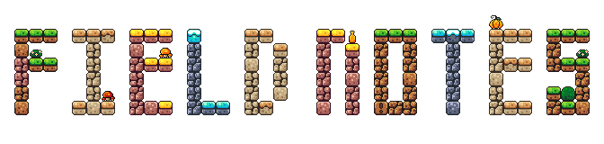
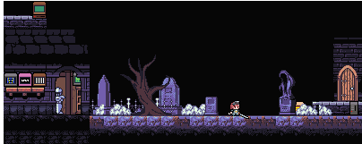

<h1></h1>

-   :material-bug:{ .lg .middle } __[Debugging](./debugging/)__

    ---
    I could have sworn I grepped for `gres` and not for `grep`...

-   :material-floppy:{ .lg .middle } __[Installations](./installations/)__

    ---

    Oh look. It's `cmake` again. What's it doing this time...

-   :material-train-car-container:{ .lg .middle } __[Containers](./containers/)__

    ---

    Have you tried building a sandbox?

-   :material-bottle-soda-classic:{ .lg .middle } __[Slurm](./slurm/)__

    ---

    That email exchange only took 15 back and forths before I understood the intricacies of backfill.

-   :material-database:{ .lg .middle } __[Storage & Filesystems](./storage_and_filesystems/)__

    ---

    Please don't open and shut your PDFs in while loops.

-   :material-server-network:{ .lg .middle } __[Networking](./networking/)__

    ---

    Dark magic.

-   :material-speedometer:{ .lg .middle } __[Performance](./performance/)__

    ---

    One core on your laptop --> one core on HPC =/= speedup.

-   :material-microsoft-visual-studio-code:{ .lg .middle } __[VS Code & IDEs](./vs_code_ides/)__

    ---

    A love hate relationship.

