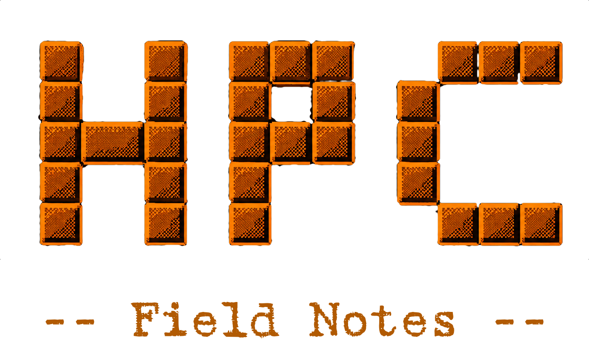

# HPC Field Notes

## What exactly is this?

!!! quote "Future me"
    FFS, why didn't you take notes???

This site functions as an informal collection of notes, recipes, debugging, and other stuff from working with high-performance computing systems. Some of these notes are polished. Some are essentially organized versions of hours of incomprehensible keyboard smashing. Basically, if I spent significant time figuring it out, I'm putting it here so Future Me doesn't hate Present Me.

## What's here?

!!! tip "I'm slow"
    I've only just started adding content to this site as of July 2026. For the time being, it will be fairly sparse as I migrate knowledge here.

-   :material-notebook-outline:{ .lg .middle } __[Field Notes](field_notes/index.md)__

    ---

    The accumulated knowledge of working with HPC systems: debugging, installations, containers, SLURM, storage, networking, performance, and remote development.

-   :material-floppy:{ .lg .middle } __[Software](./software/)__

    ---

    Notes for building, installing, configuring, and troubleshooting scientific software.

-   :material-chef-hat:{ .lg .middle } __[Recipes](./recipes/)__

    ---

    Build recipes, container recipes, and module recipes.

-   :material-chef-hat:{ .lg .middle } __[Recipes](./examples/)__

    ---

    Examples of Slurm jobs, software usage, input files, etc. 

-   :material-lightning-bolt-outline:{ .lg .middle } __[Cheat Sheets](./cheat_sheets/)__

    ---

    Quick references for Apptainer, Git, Linux, MPI, Slurm, and whatever else Future Me is likely to forget.

-   :material-book-open-variant:{ .lg .middle } __[Reference](./reference/)__

    ---

    The facts and details worth keeping close: cluster quirks, compiler flags, environment variables, useful links, and other things Future Me shouldn't have to rediscover.

## Who are you?

I'm Sara. I work in HPC facilitation, assisting researchers with running HPC workloads. Most of my time is spent breaking my environment, figuring out how other people broke their environment, coming up with HPC pipelines, debugging, software installations, writing documentation, and writing scripts for system usability. This can involve a lot of head banging and weird, hyper-specific solutions that possibly may never come up again. Or maybe they will. Which is why I'm documenting them here. Once you've solved a problem where you had to go spelunking and the only mention of your error that you could find was in a 15-year-old StackOverflow thread where someone said "solved it" with no follow up, that's a journey you don't want to take again. And sometimes you should be a good samaritan and [post your solutions](https://github.com/hhoeflin/hdf5r/issues/132#issuecomment-1122726294) :material-emoticon-sad-outline: