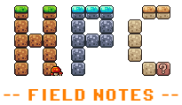
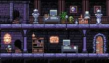

# HPC Field Notes

## What exactly is this?

!!! quote "Future me"
    FFS, why didn't you take notes???

This site functions as an informal collection of notes, recipes, debugging, and other stuff from working with high-performance computing systems. Some of these notes are polished. Some are essentially organized versions of hours of incomprehensible keyboard smashing. Basically, if I spent significant time figuring it out, I'm putting it here so Future Me doesn't hate Present Me.

To note, this site is a personal collection of notes based on working with HPC systems. This is not official documentation or policy for any institution or HPC service. 

## What's here?

!!! tip "I'm slow"
    I've only just started adding content to this site as of July 2026. For the time being, it will be fairly sparse as I migrate knowledge here.

-   :material-notebook-outline:{ .lg .middle } __[Field Notes](field_notes/index.md)__

    ---

    Notes on technical details that go beyond simple commands, how-to guides, examples, cheat sheets, and the like. Things like explanations of Slurm backfill, debugging `cmake` installations, and other knowledge gained through working with Linux and HPC systems. 

-   :material-floppy:{ .lg .middle } __[Software](./software/)__

    ---

    Notes for building, installing, configuring, and troubleshooting scientific software.

-   :material-tools:{ .lg .middle } __[How To](./how_to/)__

    ---

    Explanations on how to accomplish various tasks. For example, how can I configure VS Code (running locally) to connect to an HPC cluster, hopping through an intermediate bastion host, to launch and connect to a Slurm job on one of the cluster's compute nodes?

-   :material-chef-hat:{ .lg .middle } __[Examples](./examples/)__

    ---

    Examples of Slurm jobs, software usage, input files, etc. 

-   :material-lightning-bolt-outline:{ .lg .middle } __[Cheat Sheets](./cheat_sheets/)__

    ---

    Quick references for Apptainer, Git, Linux, MPI, Slurm, and whatever else Future Me is likely to forget.

-   :material-book-open-variant:{ .lg .middle } __[Reference](./reference/)__

    ---

    Links to external references, links I'm constantly needing to look up, and whatever else I need to remember.

-   :material-palette:{ .lg .middle } __[Personal Projects](./personal_projects/)__

    ---

    Coding projects I'm likely in the middle of and have been on pause for somewhere between months and years. Most of these are usability tools for making clusters running Slurm more accessible. The general issue I have is finding time to refactor the code...

## Who are you?

I'm Sara. I work in HPC facilitation. I assist researchers with running HPC workloads at an academic institution and spend most of my time breaking my environment, figuring out how other people broke their environment, coming up with HPC pipelines, debugging, swearing at software installations, writing documentation, and writing scripts for system usability. This inevitably involves a lot of head banging and weird, hyper-specific solutions that rarely come up again. But sometimes they do, and then I have to dig through a decade's worth of ancient emails with the inkling of "wtf, I know I've seen that error before." Or maybe I've created 10,000 open unnamed plain text files and the solution lives in one of them (I'm begging myself, stop doing this). I've hit a point where enough of these experiences have catalyzed this site's creation. My email is an okay-ish archival tool. Our public docs provide comprehensive general knowledge but isn't hyper-specific/niche enough.  My plain text document habit is frankly unacceptable. So, this site is my proposed solution. And sometimes you should be a good samaritan and [post your solutions](https://github.com/hhoeflin/hdf5r/issues/132#issuecomment-1122726294) :material-emoticon-sad-outline:

## A Note on This Site's Art

The non-technical illustrations used on this site were created by the author with the [Tileset map editor](https://thorbjorn.itch.io/tiled) using game assets from the following artists (paid for). No AI was used.

- [Computer Monitors by LiamRogersDeveloper](https://liamrogersdeveloper.itch.io/pixel-art-computer-crt-terminal-monitors)
- [Office Furniture by Antea](https://stcrbcn.itch.io/furniture-office-set)
- [Brackeys' Platformer Bundle by Brackeys](https://brackeysgames.itch.io/brackeys-platformer-bundle)
- [Tiny RPG Character Asset Pack by Zerie](https://zerie.itch.io/tiny-rpg-character-asset-pack)
- [Dark Dungeon by Raou](https://raou.itch.io/dark-dun)