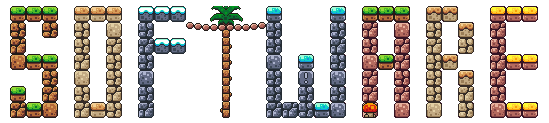

<h1></h1>

-   :material-cog:{ .lg .middle } __[Ansys](./ansys/)__

    ---

-   :material-molecule:{ .lg .middle } __[VASP](./vasp/)__

    ---

-   :material-molecule:{ .lg .middle } __[Gaussian](./gaussian/)__

    ---

-   :material-molecule:{ .lg .middle } __[Gromacs](./gromacs/)__

    ---

-   :material-molecule:{ .lg .middle } __[NAMD](./namd/)__

    ---

