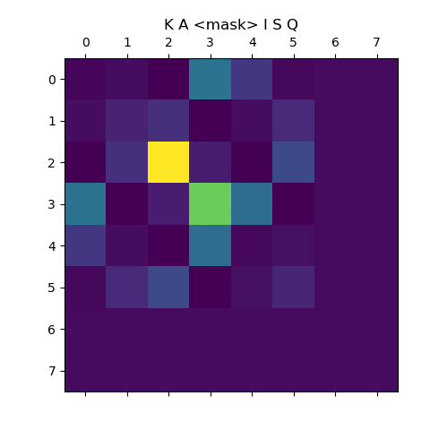

# Miscellaneous Software

## Installations

### ESMFold

* Cuda Toolkit Info: [https://anaconda.org/channels/nvidia/packages/cuda-toolkit/overview](https://anaconda.org/channels/nvidia/packages/cuda-toolkit/overview)
* Git repo: [https://github.com/facebookresearch/ESM](https://github.com/facebookresearch/ESM#esmfold)
* Pytorch: [https://pytorch.org/get-started/locally/](https://pytorch.org/get-started/locally/)

This one was a PITA. I was facing similar issues to [this GitHub issues report](https://github.com/facebookresearch/esm/issues/677) and wound up having to do some archeological digging into the specific version of openfold to hammer down the dependencies. The yaml file (`environment.yaml`) I found with:

```console
(esmfold-env) [lookitsme@r7u02n1 openfold]$ history | egrep "git clone|git checkout"
 1098  11/08/26 12:14:36 git clone https://github.com/aqlaboratory/openfold.git
 1100  11/08/26 12:14:41 git checkout 4b41059694619831a7db195b7e0988fc4ff3a307
```

That gave me enough to work with when setting up the environment. However, the MKL version wasn't pinned down, so it wound up giving me a 2026 version that resulted in an openfold installation error `undefined symbol: iJIT_NotifyEvent`. I found the specific MKL version required by this version of PyTorch using:

```console
(esmfold-env) [lookitsme@r7u02n1 openfold]$ micromamba repoquery depends pytorch=1.12 --channel pytorch
Getting repodata from channels...

pytorch/linux-64                                            Using cache
pytorch/noarch                                              Using cache
 Name                                      Version Build          Channel Subdir 
──────────────────────────────────────────────────────────────────────────────────
 blas * mkl >>> NOT FOUND <<<                                                    
 mkl >=2018 >>> NOT FOUND <<<                                                    
 python >=3.10,<3.11.0a0 >>> NOT FOUND <<<                                       
 pytorch                                   1.12.1  py3.10_cpu_0   pytorch pytorch
 pytorch-mutex                             1.0     cpu            pytorch pytorch
 typing_extensions >>> NOT FOUND <<<  
```

Which more or less got me the rest of the way there.

From OpenFold 1.0's environment yaml file:

```yaml
name: openfold_venv
channels:
  - conda-forge
  - bioconda
  - pytorch
dependencies:
  - conda-forge::python=3.7
  - conda-forge::setuptools=59.5.0
  - conda-forge::pip
  - conda-forge::openmm=7.5.1
  - conda-forge::pdbfixer
  - conda-forge::cudatoolkit==11.3.*
  - bioconda::hmmer==3.3.2
  - bioconda::hhsuite==3.3.0
  - bioconda::kalign2==2.04
  - pytorch::pytorch=1.12.*
  - pip:
      - biopython==1.79
      - deepspeed==0.5.10
      - dm-tree==0.1.6
      - ml-collections==0.1.0
      - numpy==1.21.2
      - PyYAML==5.4.1
      - requests==2.26.0
      - scipy==1.7.1
      - tqdm==4.62.2
      - typing-extensions==3.10.0.2
      - pytorch_lightning==1.5.10
      - wandb==0.12.21
      - git+https://github.com/NVIDIA/dllogger.git
```

I used that to build the relevant environment and forced MKL to downgrade to 2022. I also had to install `gcc` and `g++` in my micromamba environment since there were a few other issues that cropped up when trying to use the system gcc. The full installation wound up being:

```console
[lookitsme@r7u02n1 openfold]$ micromamba create -n esmfold-env python=3.7
[lookitsme@r7u02n1 openfold]$ micromamba activate esmfold-env
(esmfold-env) [lookitsme@r7u02n1 openfold]$ micromamba install -c "nvidia/label/cuda-11.3.1" cuda-toolkit
(esmfold-env) [lookitsme@r7u02n1 openfold]$ micromamba install \
    conda-forge::setuptools=59.5.0 \
    conda-forge::openmm=7.5.1 \
    conda-forge::pdbfixer \
    bioconda::hmmer=3.3.2 \
    bioconda::hhsuite=3.3.0 \
    bioconda::kalign2=2.04 \
    pytorch::pytorch=1.12.*
(esmfold-env) [lookitsme@r7u02n1 openfold]$ pip install \
    biopython==1.79 \
    deepspeed==0.5.10 \
    dm-tree==0.1.6 \
    ml-collections==0.1.0 \
    numpy==1.21.2 \
    PyYAML==5.4.1 \
    requests==2.26.0 \
    scipy==1.7.1 \
    tqdm==4.62.2 \
    typing-extensions==3.10.0.2 \
    pytorch_lightning==1.5.10 \
    wandb==0.12.21
(esmfold-env) [lookitsme@r7u02n1 openfold]$ pip install fair-esm 
(esmfold-env) [lookitsme@r7u02n1 openfold]$ pip install "fair-esm[esmfold]"
(esmfold-env) [lookitsme@r7u02n1 openfold]$ pip install 'dllogger @ git+https://github.com/NVIDIA/dllogger.git'
(esmfold-env) [lookitsme@r7u02n1 openfold]$ micromamba install "mkl=2022.0"
(esmfold-env) [lookitsme@r7u02n1 openfold]$ micromamba install conda-forge::gcc==11.1.0
(esmfold-env) [lookitsme@r7u02n1 openfold]$ micromamba install conda-forge::gxx==11.1.0
(esmfold-env) [lookitsme@r7u02n1 openfold]$ pip install 'openfold @ git+https://github.com/aqlaboratory/openfold.git@4b41059694619831a7db195b7e0988fc4ff3a307'
(esmfold-env) [lookitsme@r7u02n1 openfold]$ micromamba install matplotlib
(esmfold-env) [lookitsme@r7u02n1 openfold]$ micromamba install --channel=conda-forge libxcrypt
(esmfold-env) [lookitsme@r7u02n1 openfold]$ export CPATH=/groups/SOFTWARE/micromamba/envs/esmfold-env/include/
(esmfold-env) [lookitsme@r7u02n1 openfold]$ pip install biotite
```

With the `biotite`, `libcryptx`, and `matplotlib` installations done to allow me to run the provided examples. The `CPATH` had to be used, otherwise the `biotite` package wasn't able to find the `crypt.h` header file.

Once I did all that, I ran some test Python scripts they gave (modifying it to save the figure rather than display it):

```python
import torch
import esm

# Load ESM-2 model
model, alphabet = esm.pretrained.esm2_t33_650M_UR50D()
batch_converter = alphabet.get_batch_converter()
model.eval()  # disables dropout for deterministic results

# Prepare data (first 2 sequences from ESMStructuralSplitDataset superfamily / 4)
data = [
    ("protein1", "MKTVRQERLKSIVRILERSKEPVSGAQLAEELSVSRQVIVQDIAYLRSLGYNIVATPRGYVLAGG"),
    ("protein2", "KALTARQQEVFDLIRDHISQTGMPPTRAEIAQRLGFRSPNAAEEHLKALARKGVIEIVSGASRGIRLLQEE"),
    ("protein2 with mask","KALTARQQEVFDLIRD<mask>ISQTGMPPTRAEIAQRLGFRSPNAAEEHLKALARKGVIEIVSGASRGIRLLQEE"),
    ("protein3",  "K A <mask> I S Q"),
]
batch_labels, batch_strs, batch_tokens = batch_converter(data)
batch_lens = (batch_tokens != alphabet.padding_idx).sum(1)

# Extract per-residue representations (on CPU)
with torch.no_grad():
    results = model(batch_tokens, repr_layers=[33], return_contacts=True)
token_representations = results["representations"][33]

# Generate per-sequence representations via averaging
# NOTE: token 0 is always a beginning-of-sequence token, so the first residue is token 1.
sequence_representations = []
for i, tokens_len in enumerate(batch_lens):
    sequence_representations.append(token_representations[i, 1 : tokens_len - 1].mean(0))

# Look at the unsupervised self-attention map contact predictions
import matplotlib.pyplot as plt
for (_, seq), tokens_len, attention_contacts in zip(data, batch_lens, results["contacts"]):
    plt.matshow(attention_contacts[: tokens_len, : tokens_len])
    plt.title(seq)
    plt.savefig("test.png")
```

and it generated 



and the second test, to test ESM Fold:

```python 
import torch
import esm

model = esm.pretrained.esmfold_v1()
model = model.eval().cuda()

# Optionally, uncomment to set a chunk size for axial attention. This can help reduce memory.
# Lower sizes will have lower memory requirements at the cost of increased speed.
# model.set_chunk_size(128)

sequence = "MKTVRQERLKSIVRILERSKEPVSGAQLAEELSVSRQVIVQDIAYLRSLGYNIVATPRGYVLAGG"
# Multimer prediction can be done with chains separated by ':'

with torch.no_grad():
    output = model.infer_pdb(sequence)

with open("result.pdb", "w") as f:
    f.write(output)

import biotite.structure.io as bsio
struct = bsio.load_structure("result.pdb", extra_fields=["b_factor"])
print(struct.b_factor.mean())  # this will be the pLDDT
# 88.3
```

gave

```console title="ESM Fold test on a GPU node"
(esmfold-env) [lookitsme@r5u15n1 openfold]$ python3 test.py 
88.28930830039526
```

### ProteinMPNN

```console
[lookitsme@r7u03n2 contrib]$ git clone https://github.com/dauparas/ProteinMPNN.git
[lookitsme@r7u03n2 contrib]$ cd ProteinMPNN
[lookitsme@r7u03n2 ProteinMPNN]$ micromamba create --prefix=$PWD/env/ProteinMPNN python=3.7
[lookitsme@r7u03n2 ProteinMPNN]$ micromamba activate $PWD/$ProteinMPNN/env/ProteinMPNN
(ProteinMPNN) [lookitsme@r7u03n2 ProteinMPNN]$ micromamba install -c "nvidia/label/cuda-11.3.1" cuda-toolkit
(ProteinMPNN) [lookitsme@r7u03n2 ProteinMPNN]$ micromamba install pytorch::pytorch=1.12.*
(ProteinMPNN) [lookitsme@r7u03n2 mpnn_example]$ micromamba install numpy
(ProteinMPNN) [lookitsme@r7u03n2 mpnn_example]$ micromamba install "mkl=2022.0"
```

To note, the `mkl` installation was required to fix

```
ImportError: /contrib/ProteinMPNN/env/ProteinMPNN/lib/python3.7/site-packages/torch/lib/libtorch_cpu.so: undefined symbol: iJIT_NotifyEvent
```

To test:

```bash
#!/bin/bash

micromamba activate mlfold

folder_with_pdbs="/contrib/ProteinMPNN/inputs/PDB_monomers/pdbs/"

output_dir="/xdisk/lookitsme/TICKETS/mpnn_example/output"

path_for_parsed_chains=$output_dir"/parsed_pdbs.jsonl"

python /contrib/ProteinMPNN/helper_scripts/parse_multiple_chains.py --input_path=$folder_with_pdbs --output_path=$path_for_parsed_chains

python /contrib/ProteinMPNN/protein_mpnn_run.py \
        --jsonl_path $path_for_parsed_chains \
        --out_folder $output_dir \
        --num_seq_per_target 2 \
        --sampling_temp "0.1" \
        --seed 37 \
        --batch_size 1
```

### RFDiffusion

This particular install had the issue of the historical versions of PyTorch specified in the environment requirements pulling the CPU-only versions.

https://github.com/RosettaCommons/RFdiffusion

```bash
git clone https://github.com/RosettaCommons/RFdiffusion.git
cd RFdiffusion
mkdir models && cd models
wget http://files.ipd.uw.edu/pub/RFdiffusion/6f5902ac237024bdd0c176cb93063dc4/Base_ckpt.pt
wget http://files.ipd.uw.edu/pub/RFdiffusion/e29311f6f1bf1af907f9ef9f44b8328b/Complex_base_ckpt.pt
wget http://files.ipd.uw.edu/pub/RFdiffusion/60f09a193fb5e5ccdc4980417708dbab/Complex_Fold_base_ckpt.pt
wget http://files.ipd.uw.edu/pub/RFdiffusion/74f51cfb8b440f50d70878e05361d8f0/InpaintSeq_ckpt.pt
wget http://files.ipd.uw.edu/pub/RFdiffusion/76d00716416567174cdb7ca96e208296/InpaintSeq_Fold_ckpt.pt
wget http://files.ipd.uw.edu/pub/RFdiffusion/5532d2e1f3a4738decd58b19d633b3c3/ActiveSite_ckpt.pt
wget http://files.ipd.uw.edu/pub/RFdiffusion/12fc204edeae5b57713c5ad7dcb97d39/Base_epoch8_ckpt.pt
wget http://files.ipd.uw.edu/pub/RFdiffusion/f572d396fae9206628714fb2ce00f72e/Complex_beta_ckpt.pt
wget http://files.ipd.uw.edu/pub/RFdiffusion/1befcb9b28e2f778f53d47f18b7597fa/RF_structure_prediction_weights.pt
cd ..
micromamba env create -f env/SE3nv.yml --prefix=$PWD/env/SE3nv
micromamba activate $PWD/env/SE3nv
cd env/SE3Transformer
pip install --no-cache-dir -r requirements.txt
python setup.py install
cd ../.. 
pip install -e . 
```

Then, to patch the pytorch issues:

```console
(SE3nv) [lookitsme@r7u25n1 RFdiffusion]$ python -c "import torch; print(torch.__version__); print(torch.version.cuda); print(torch.cuda.is_available())"
1.9.1.post3
None
False
(SE3nv) [lookitsme@r7u25n1 RFdiffusion]$ python -m pip uninstall -y torch torchvision torchaudio
Found existing installation: torch 1.9.1.post3
Uninstalling torch-1.9.1.post3:
  Successfully uninstalled torch-1.9.1.post3
Found existing installation: torchvision 0.15.2a0
Uninstalling torchvision-0.15.2a0:
  Successfully uninstalled torchvision-0.15.2a0
Found existing installation: torchaudio 0.9.0a0+a85b239
Uninstalling torchaudio-0.9.0a0+a85b239:
  Successfully uninstalled torchaudio-0.9.0a0+a85b239
(SE3nv) [lookitsme@r7u25n1 RFdiffusion]$ micromamba remove pytorch torchvision torchaudio
(SE3nv) [lookitsme@r7u25n1 RFdiffusion]$ pip install \
    torch==1.9.1+cu111 \
    torchvision==0.10.1+cu111 \
    torchaudio==0.9.1 \
    -f https://download.pytorch.org/whl/torch_stable.html
```

then, to finish:

```bash
(SE3nv) [lookitsme@r7u03n2 RFdiffusion]$ tar -xvf examples/ppi_scaffolds_subset.tar.gz -C examples/
(SE3nv) [lookitsme@r7u03n2 RFdiffusion]$ ln -s $PWD/config $PWD/env/SE3nv/config
```

### EMSoft

```bash
git clone --recursive https://github.com/EMsoft-org/EMsoftSuperbuild.git
export SDK_DIR=$PWD/EMsoft_SDK
mkdir Debug && cd Debug
cmake -DEMsoft_SDK=$SDK_DIR -DCMAKE_BUILD_TYPE=Debug ..
make -j
mkdir ../Release && cd ../Release
cmake -DEMsoft_SDK=$SDK_DIR -DCMAKE_BUILD_TYPE=Release ..
cd ../..
git clone --recursive https://github.com/EMsoft-org/EMsoftData.git
export DATADIR=$PWD/EMsoftData
git clone --recursive https://github.com/EMsoft-org/EMsoft.git
cd EMsoft
mkdir EMsoftBuild
cd EMsoftBuild/
mkdir Release && cd Release
module load cuda12
cmake -DCMAKE_BUILD_TYPE=Release -DEMsoft_SDK=$SDK_DIR -DOpenCL_INCLUDE_DIR=/opt/ohpc/pub/apps/cuda12/12.5/targets/x86_64-linux/include -DOpenCL_LIBRARY=/opt/ohpc/pub/apps/cuda12/12.5/targets/x86_64-linux/lib/libOpenCL.so -DEMsoftData_Dir=$DATADIR ../../
make -j
mkdir ../Debug && cd ../Debug
cmake -DCMAKE_BUILD_TYPE=Debug -DEMsoft_SDK=$SDK_DIR -DOpenCL_INCLUDE_DIR=/opt/ohpc/pub/apps/cuda12/12.5/targets/x86_64-linux/include -DOpenCL_LIBRARY=/opt/ohpc/pub/apps/cuda12/12.5/targets/x86_64-linux/lib/libOpenCL.so -DEMsoftData_Dir=$DATADIR ../../
```

### Intel NCO

```bash
module purge
module load intel
module load phdf5 netcdf
module load libaec antlr gsl
tar xvzvf 5.3.1.tar.gz
cd nco-5.3.1/
export CC=$(which icx)
export CXX=$(which icpx)
export CPPFLAGS="-I/usr/include/udunits2 $CPPFLAGS"
./configure --enable-gsl --enable-udunits2 --includedir=/usr/include/udunits2 --prefix=/opt/ohpc/admin/UAbuild/nco-intel/INSTALL
make -j4
```


## Apptainer Recipes

### AddaxAI

```apptainer title="AddaxAI.recipe"
Bootstrap: docker
From: ubuntu:24.04

%post 
  apt update -y
  apt install build-essential zlib1g-dev libncurses5-dev libgdbm-dev libnss3-dev libssl-dev libreadline-dev libffi-dev libsqlite3-dev wget libbz2-dev git -y 
  apt-get update && \
  apt-get install -y libgl1 libglib2.0-0
  wget https://petervanlunteren.github.io/AddaxAI/install_files/linux/install.command
  sed -i 's/\bsudo\b//g' install.command
  chmod +x install.command
  mkdir ~/Desktop
  ./install.command
```